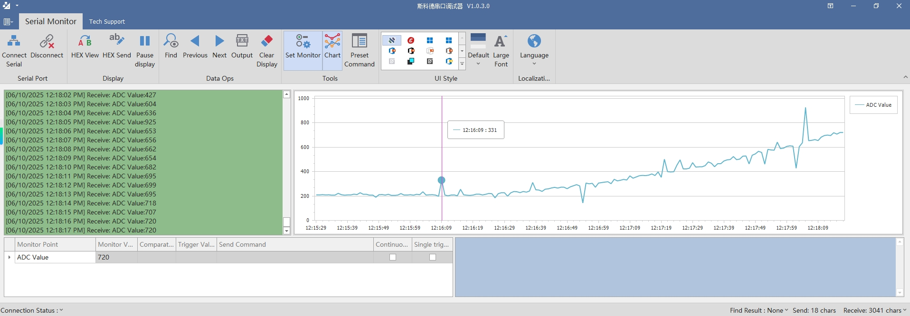
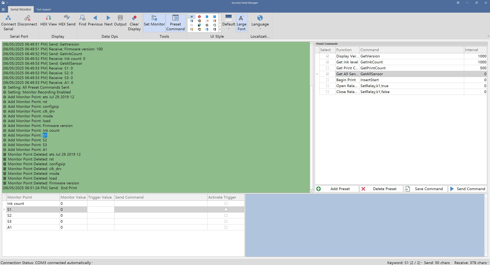
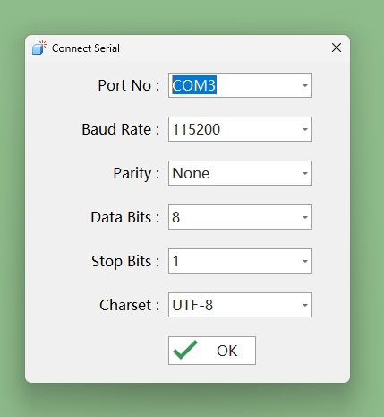
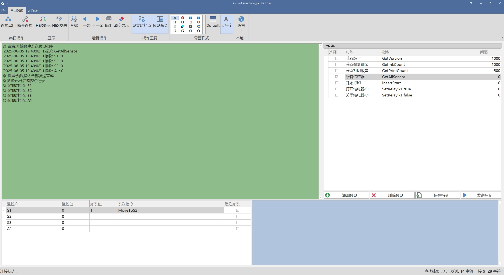

New version 1.0.3
1. Added monitoring chart functionality
2. Added comparison conditions for monitoring points
3. Added single-trigger command sending feature

# Serial Port Debugger
# Overview
Serial Port Debugger is a powerful and user-friendly software tool designed for serial communication debugging. Widely used in embedded development, hardware debugging, and production testing, this tool supports comprehensive serial port configuration and enables efficient data transmission, reception, and automated testing. It is an essential assistant for engineers and technical professionals.

# Key Features

Serial Port Connection & Configuration
Automatically detects available serial devices. Flexible settings for baud rate, data bits, parity, stop bits, and more to meet various hardware communication requirements.

# Data Sending & Receiving
Supports both text and hexadecimal formats. The receiving area can display timestamps, auto line breaks, and is optimized for communication analysis.

# Command Presets & Quick Operations
Built-in command preset management for batch storage and one-click sending of common instructions, greatly improving debugging efficiency.

# Data Monitoring Points
Allows users to define monitoring points and set auto-triggered commands for automated responses and batch testing.

# Multilingual Support
Integrated with multilingual interface translation, adapting to global users’ software usage habits.

# Customizable Interface Themes
Multiple UI themes available; friendly interface and easy to operate.

# Character Statistics & Log Export
Real-time statistics of sent/received characters. Supports exporting communication logs for analysis and archiving.

# Advanced Search & Navigation
Built-in search function for keyword positioning and historical data tracking.

# Application Scenarios
Debugging communication between microcontrollers and development boards

Analyzing and testing serial protocols of industrial equipment and instruments

Command interaction and debugging for smart hardware

Engineering fields such as automated production and remote device monitoring

# Software Highlights

Clean interface and intuitive operations; easy for beginners

Rich features and broad compatibility with various serial devices

Multilingual and theme customization for excellent user experience

Continuously updated and optimized for high stability

# License Statement
This software is not open source but is free to download and use. Reverse engineering or illegal use is strictly prohibited. All copyrights are owned by Succeed Technology Co., Ltd.

Contact Us 
For custom features, business cooperation, or technical support, please contact: Support@fezid.com

# 中文
串口调试工具（Serial Port Debugger）
简介
串口调试工具是一款功能强大、操作简便的串口通信调试软件，广泛应用于嵌入式开发、硬件调试、生产测试等场景。软件支持多种常用串口协议设置，能够高效完成数据发送、接收及自动化测试任务，是开发工程师和技术人员的得力助手。

# 主要功能

# 串口连接与参数配置
支持多串口设备自动检测，灵活设置波特率、数据位、校验位、停止位等串口参数，满足不同硬件通信需求。

# 数据发送与接收
支持文本与十六进制两种格式的数据收发，接收区可显示时间戳、自动换行，便于分析通信过程。

# 指令预设与快速操作
内置指令预设功能，可批量管理常用命令，一键发送，极大提高调试效率。

# 数据监控点
可自定义关键数据监控点，设定自动触发指令，实现自动响应和批量测试。

# 多语言支持
集成多国语言界面翻译，适应全球用户的软件使用习惯。

# 界面主题与美观设计
多种主题皮肤可选，界面友好，易于操作。

# 字符统计与日志导出
实时统计发送、接收字符数，支持日志数据导出，方便后续分析与归档。

# 高级查找与跳转
内置查找功能，支持关键字定位与历史数据回溯。

# 适用场景

单片机与开发板通信调试

工业设备、仪表的串口协议分析与测试

智能硬件的命令交互与调试

自动化生产、设备远程监控等工程领域

# 软件特点

界面简洁、操作直观，新手快速上手

功能丰富，兼容多种串口设备

支持多语言和主题定制，用户体验优异

持续更新优化，稳定可靠

# 授权声明
本软件为非开源产品，可自由下载安装和使用，但不允许反编译、逆向工程或用于非法用途。软件著作权归北京斯科德科技有限公司所有。

# 联系方式
如需定制功能、企业合作或技术支持，请联系：Support@fezid.com
